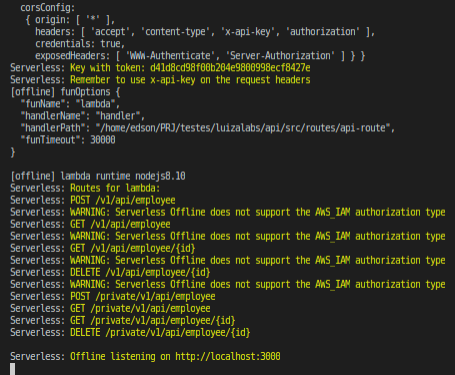
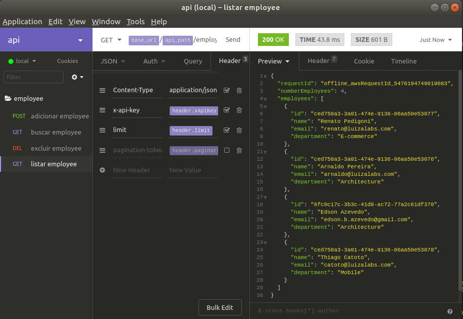
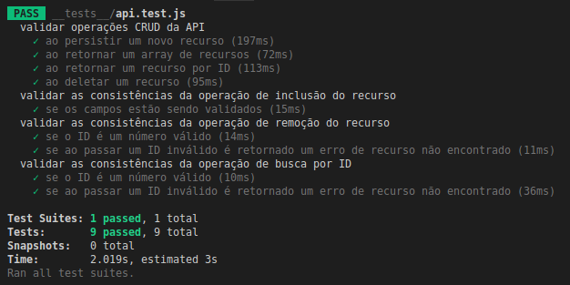

{:toc}

# Apoio Técnico
## Estrutura do projeto

* src/
  * controller/
  * model/
  * repositories/
  * routes/
  * services/
  * util/
  * validators/
* doc/
* contract/
* \__tests\__/

### IDE

#### Visual Studio Code

IDE utilizada para o desenvolvimento da API

##### Extensões

- ESLint 1.4.12
- Jest 2.9.0

### Tecnologias

Esta API utiliza os seguintes projetos de opensource para facilitar no desenvolvimento:

- [apidoc](http://apidocjs.com/) - Documentação Inline para APIs RESTful
- [axios](https://www.npmjs.com/package/axios) - Cliente HTTP baseado em promises utilizado nos testes
- [jest](https://jestjs.io/en/) - Ferramenta de teste Javascript desenvolvida pelo Facebook
- [eslint](https://eslint.org/docs/user-guide/getting-started) - O ESLint é uma ferramenta para identificar e relatar padrões encontrados no código ECMAScript / JavaScript, com o objetivo de tornar o código mais consistente e evitar erros
- [serverless]() - A plataforma serverless permite que os desenvolvedores criem e implementem aplicativos sem servidor, em qualquer provedor.
- [serverless-dynamodb-local]() - Plugin do Dynamo para uso local
- [serverless-offline]() - Plugin para rodar plataforma serverless offline

### Instalação

Requer [Node.js](https://nodejs.org/) (**versão 8 ou superior é necessário**) e [Yarn](https://yarnpkg.com/lang/pt-br/docs/install/#debian-stable)

#### Instalação dos módulos Node

```text
$ cd luizalabs/api
$ yarn
```

### Execução

#### Servidor

Executar o comando abaixo para inicialização do servidor local

```text
$ yarn start
```

O seguinte resultado deve ser obtido:



**Importante** verificar se o token do *x-api-key* se manteve o mesmo do exibido na imagem acima. Caso seja diferente, alterar esta informação no header HTTP das requisições dos testes.

#### Testes

##### Insomnia

Instalar o [Insomnia](https://insomnia.rest/download/) e importar o seguinte arquivo de workspace **./luizalabs/api/____tests____/employee-api_v1.json**.

Executar as operações conforme imagem abaixo:



##### Jest

Framework utilizado no projeto foi o Jest que é usado pelo Facebook para testar todo o código JavaScript, incluindo os aplicativos React. Uma das filosofias de Jest é fornecer uma experiência integrada de "configuração zero".

Outro benefício do uso do Jest é também a integração através de extension com a IDE.

Mais informação em [Jest](https://jestjs.io/en/).

Para execução dos testes executar o seguinte comando:

```text
$ yarn test
```

 O seguinte resultado deve ser obtido:




# Especificação Funcional

API REST que permite o armazenamento e busca de dados dos funcionários. 

Abaixo encontram-se as descrições macro de cada recurso bem como seus fluxogramas.

## Adiciona Funcionário

Recurso que persiste em banco de dados as informações referente ao funcionário.

| Ator | Sistema        | Função                                  |
| ---- | -------------- | --------------------------------------- |
|      | Consumidor     | Sistema responsável pelo consumo da API |
|      | API Employee   | API REST de gestão de funcionários      |
|      | Banco de Dados | Banco não relacional (DynamoDB)         |

```sequence
    Consumidor->>API Employee: Envia Request (POST)
    API Employee->>Banco de Dados: Valida e envia Dados
    	Note right of Banco de Dados: Persiste dados
    Banco de Dados-->>API Employee: Retorna status
    API Employee-->>Consumidor: Retorna Response
```


## Busca Funcionário

Recurso que busca um funcionário a partir de seu id no banco de dados.

| Ator | Sistema        | Função                                  |
| ---- | -------------- | --------------------------------------- |
|      | Consumidor     | Sistema responsável pelo consumo da API |
|      | API Employee   | API REST de gestão de funcionários      |
|      | Banco de Dados | Banco não relacional (DynamoDB)         |

```sequence
    Consumidor->>API Employee: Envia Request (GET)
    API Employee->>Banco de Dados: Valida e consulta dados
    Banco de Dados-->>API Employee: Retorna dados
    API Employee-->>Consumidor: Retorna Response
```


## Busca Funcionários

Recurso que busca uma lista dos funcionários persistidos em banco de dados.

| Ator | Sistema        | Função                                  |
| ---- | -------------- | --------------------------------------- |
|      | Consumidor     | Sistema responsável pelo consumo da API |
|      | API Employee   | API REST de gestão de funcionários      |
|      | Banco de Dados | Banco não relacional (DynamoDB)         |

```sequence
    Consumidor->>API Employee: Envia Request (GET)
    API Employee->>Banco de Dados: Valida e consulta dados
    Banco de Dados-->>API Employee: 
    API Employee-->>Consumidor: Retorna Response
```


# Especificação Técnica

## Configurações / Dependências

Ex.: Parâmetros, URL externas

## Autorização

Ex.: Header (X-Api-Key, Token)

## Recursos

POST /v1/api/employee

```bash
curl -i -H "Content-Type: application/javascript" -H "x-api-key: d41d8cd98f00b204e9800998ecf8427e" -X POST -d '{"name":"Edson Azevedo","email":"edson.b.azevedo@gmail.com","department":"Architecture"}' http://localhost:3000/private/v1/api/employee/
```

GET /v1/api/employee/{id}

```bash
curl -i -H "Content-Type: application/javascript" -H "x-api-key: d41d8cd98f00b204e9800998ecf8427e" http://localhost:3000/private/v1/api/employee/ced758a3-3a01-474e-9136-06aa50e53076
```

GET /v1/api/employee

```bash
curl -i -H "Content-Type: application/javascript" -H "x-api-key: d41d8cd98f00b204e9800998ecf8427e" -H "limit: 10" http://localhost:3000/private/v1/api/employee/
```

DELETE /v1/api/employee

```bash
curl -i -H "Content-Type: application/javascript" -H "x-api-key: d41d8cd98f00b204e9800998ecf8427e" -X DELETE http://localhost:3000/private/v1/api/employee/ced758a3-3a01-474e-9136-06aa50e53076
```


